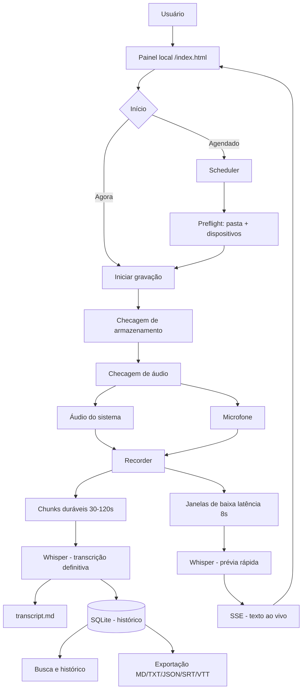

# Meeting Intelligence

Software local-first que grava reuniões e aulas (áudio do computador +
microfone, simultaneamente), transcreve com Whisper rodando na própria
máquina, organiza um histórico pesquisável e permite agendar gravações
automáticas — sem bot entrando em nenhuma chamada, sem áudio saindo do
seu computador, sem custo por minuto.

## O problema

Reuniões e aulas geram informação valiosa que se perde: ninguém anota
tudo, gravações ficam soltas em pastas sem organização, e serviços de
transcrição em nuvem cobram por minuto e exigem enviar áudio (às vezes
sensível) para servidores de terceiros.

## A solução

Um agente Python que roda inteiramente na sua máquina: captura o áudio
que está tocando no computador (a fala dos outros participantes) e o seu
microfone ao mesmo tempo, transcreve com [faster-whisper](https://github.com/SYSTRAN/faster-whisper)
localmente, salva tudo organizado por reunião, e recupera sozinho de
quedas de energia ou crashes sem perder o que já foi gravado. Também
permite **agendar** gravações (aula de segunda às 19h, toda semana) e
manter um **histórico pesquisável** de tudo que já foi gravado.

## Principais funcionalidades

- **Captura simultânea**: áudio do computador (loopback WASAPI) e
  microfone, em canais separados, com seleção explícita de dispositivo e
  medidor de nível ao vivo.
- **Transcrição em duas velocidades**: uma prévia de baixa latência
  (segundos) para acompanhar ao vivo, e uma transcrição definitiva por
  bloco (mais precisa) que substitui a prévia quando fica pronta.
- **Nunca perde áudio**: gravação e transcrição rodam em threads
  separadas — se o Whisper atrasar, a gravação continua normalmente.
  Encerramento sempre gracioso (nunca `kill` direto): o bloco em
  andamento termina de ser escrito antes do processo fechar.
- **Recuperação automática**: se o processo morrer no meio (queda de
  energia, crash), o painel detecta sozinho na próxima abertura e oferece
  reprocessar os blocos pendentes, sem apagar nada.
- **Agendamento**: uma reunião recorrente ("toda segunda 19h-20h40")
  dispara início/fim automáticos, com checagem prévia de pasta/
  dispositivo (preflight) e tratamento explícito de "esqueci de abrir o
  app" (marcado como perdido, nunca começa silenciosamente atrasado).
- **Histórico e busca**: cada reunião gravada fica pesquisável (por
  título ou conteúdo da transcrição) num índice local (SQLite).
- **Exportação**: Markdown, TXT, JSON, SRT e VTT, gerados sob demanda.
- **100% local**: o Whisper roda offline depois de baixado uma vez; nada
  é enviado a nenhum serviço externo.

## Como funciona



Fluxogramas detalhados de cada etapa (gravação, encerramento gracioso,
recuperação, agendamento, schema do banco) estão em
`docs/FLOWCHARTS.md`.

## Arquitetura

- **Backend**: Python, biblioteca padrão sempre que possível (o painel
  HTTP em `webui.py` não usa Flask/FastAPI). `faster-whisper` para
  transcrição, `soundcard` para captura de áudio (WASAPI no Windows),
  `sqlite3` (stdlib) para o histórico.
- **Frontend ativo**: `index.html` + JavaScript puro (`fetch`/SSE), servido
  pelo próprio `webui.py`. Uma migração para React + TypeScript + Vite +
  Tailwind está em preparação (`frontend/`) mas ainda não é a interface
  ativa — ver "Estado atual".
- **Local-first**: nenhuma dependência de nuvem obrigatória; o único
  acesso à internet é o download do modelo Whisper na primeira vez.

## Fluxo completo

```
Usuário → Painel (index.html) → API local (webui.py) → Session Manager
   → Audio Pipeline (sistema + microfone) → Whisper (ao vivo + durável)
   → transcript.md + SQLite → Histórico/Busca/Exportação
```

Agendamentos entram pelo Scheduler (`meeting_transcriber.scheduling`),
que dispara a mesma sequência de início no horário programado.

## Tecnologias

Python 3.9+, `faster-whisper` (CTranslate2), `soundcard`, `sqlite3`,
`tzdata`/`tzlocal`, `numpy`, `soundfile`. Frontend em preparação: React
19, TypeScript, Vite, Tailwind CSS v4 (sem Next.js).

## Como executar

**Modo fácil (Windows, sem terminal):** dê dois cliques em `iniciar.bat`.
Na primeira vez ele cria o ambiente virtual e instala as dependências
sozinho; depois abre direto o painel em `http://127.0.0.1:8765`.

**Manual:**

```bash
python -m venv .venv
source .venv/bin/activate  # Windows: .venv\Scripts\activate
pip install -r requirements.txt
python webui.py
```

Também dá para usar só a linha de comando, sem o painel:

```bash
python -m meeting_transcriber --output reuniao.md --model small --language pt \
  --capture-system --capture-microphone
```

`Ctrl+C` encerra graciosamente: o bloco em andamento termina de ser
salvo/transcrito antes do processo fechar. Veja `python -m meeting_transcriber --help`
para todas as opções (modelo, dispositivo de áudio, preset de transcrição
ao vivo, etc.).

### Requisitos de áudio por sistema operacional

- **Windows**: nativo (WASAPI) — o que este projeto foi desenvolvido e
  testado. Sem driver extra.
- **Linux (PulseAudio/PipeWire)**: loopback via fonte "monitor" — não
  testado nesta sessão de desenvolvimento.
- **macOS**: sem loopback nativo; requer um dispositivo virtual como o
  [BlackHole](https://github.com/ExistentialAudio/BlackHole) — não
  testado nesta sessão.

## Testes

```bash
pip install pytest
pytest
```

Mais de 600 testes, majoritariamente com dublês (fakes) de hardware de
áudio, relógio e Whisper — não exigem microfone, placa de som real, nem
baixar nenhum modelo. Um subconjunto separado (`test_*_hardware.py`) usa
hardware de áudio real quando disponível e é pulado automaticamente
quando não há dispositivo de áudio no ambiente (ex.: CI). Ver
`docs/TESTING.md` para a estratégia completa.

## Privacidade

Áudio e transcrições nunca saem da sua máquina. O único tráfego de rede
é o download do modelo Whisper (uma vez, via Hugging Face Hub) — depois
disso o app funciona 100% offline. Nenhum dado é enviado a nenhum
serviço de terceiros; não há telemetria.

## Estrutura do projeto

```
src/meeting_transcriber/
  cli.py                 # ponto de entrada: junta captura + transcrição + escrita
  recorder.py            # thread de gravação (blocos duráveis)
  transcriber.py         # transcrição durável (Whisper -> .md)
  markdown_writer.py     # escrita incremental do .md
  session.py             # modelo de sessão persistente + recuperação
  validation.py          # validação das entradas da API do painel
  settings.py            # configurações locais do app
  folder_dialog.py       # seletor nativo de pasta
  whisper_config.py      # presets de modelo + detecção segura de CUDA
  audio/                 # dispositivos, captura dupla, mixer, níveis (Fase C)
  scheduling/            # agendamento de gravações (Fase C.1)
  live/                  # transcrição ao vivo de baixa latência (Fase D)
  storage/               # histórico/busca em SQLite (Fase E)
  export/                # exportação markdown/txt/json/srt/vtt (Fase I)
webui.py                 # servidor HTTP local (stdlib) que serve o painel e a API
index.html               # interface ativa do painel (sem framework)
frontend/                # migração para React em preparação (Fase F, não ativa)
iniciar.bat              # launcher de um clique
tests/                   # suite de testes (fakes + hardware real quando disponível)
docs/                    # arquitetura, API, fases, segurança, pendências
```

## Estado atual

| Fase | Status |
|---|---|
| A — Auditoria | Concluída |
| B — Storage, sessões, recovery | Concluída |
| C — Áudio (sistema + microfone) | Concluída |
| C.1 — Agendamento de gravações | Concluída (sem UI; sem iniciar com o app fechado) |
| D — Transcrição quase em tempo real | Núcleo concluído |
| E — SQLite + histórico | Escopo reduzido, funcional |
| F — Frontend React | 7 telas reais (Dashboard, Nova Reunião, Gravação, Detalhe, Agendamentos, Configurações) — falta Histórico paginado e testes |
| G — Inteligência (resumo/tarefas/decisões) | Não iniciada |
| H — Diarização | Versão leve (rótulo por canal, não por voz) |
| I — Exportações | Markdown/TXT/JSON/SRT/VTT concluídos; DOCX/PDF/instalador não |

Detalhe completo, incluindo o que cada fase deliberadamente deixou de
fora, em `docs/PENDENCIAS.md` e `docs/ROADMAP.md`.

## Roadmap

Ver `docs/ROADMAP.md` (histórico de fases) e `docs/PENDENCIAS.md`
(pendências priorizadas P0-P3).
