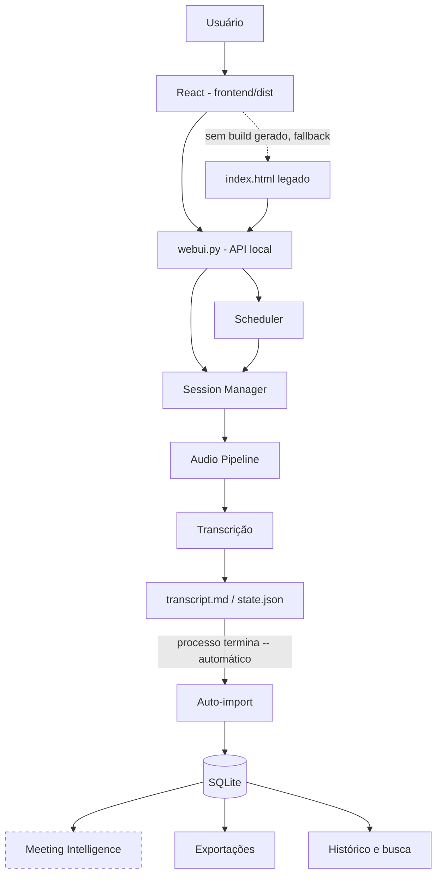
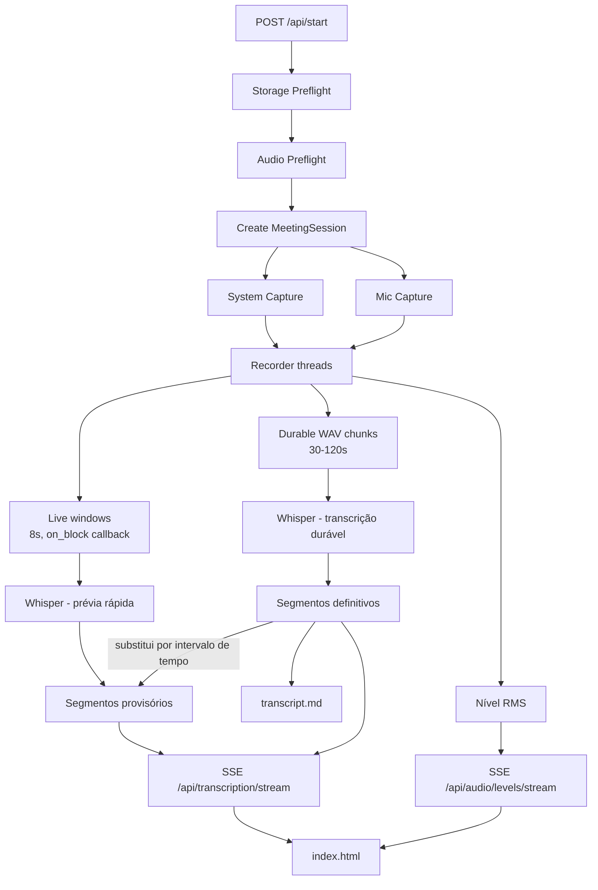
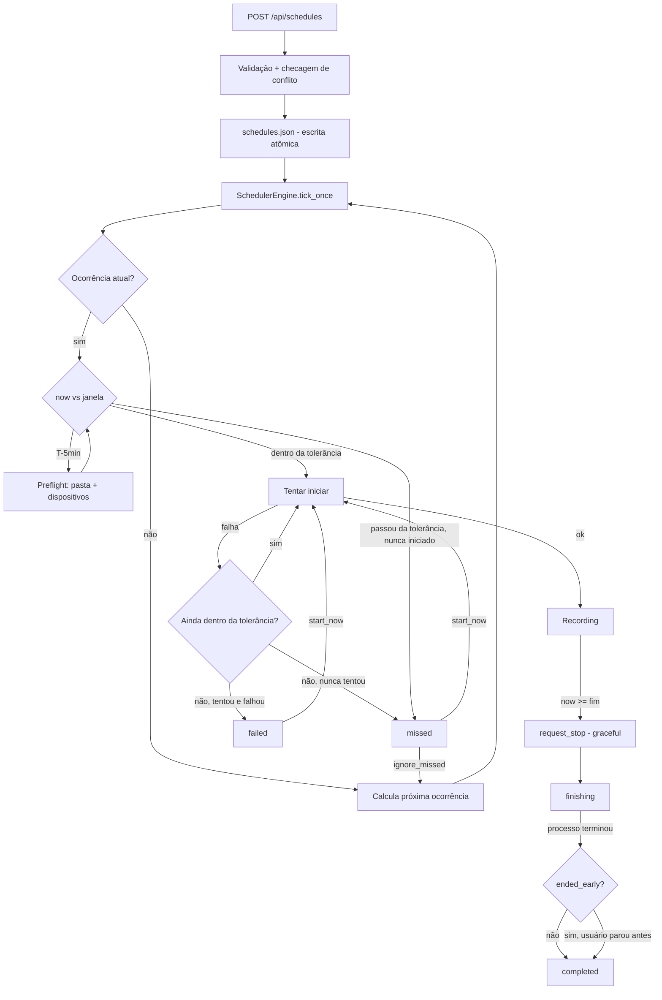
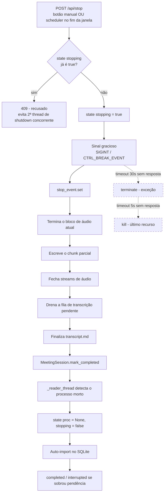
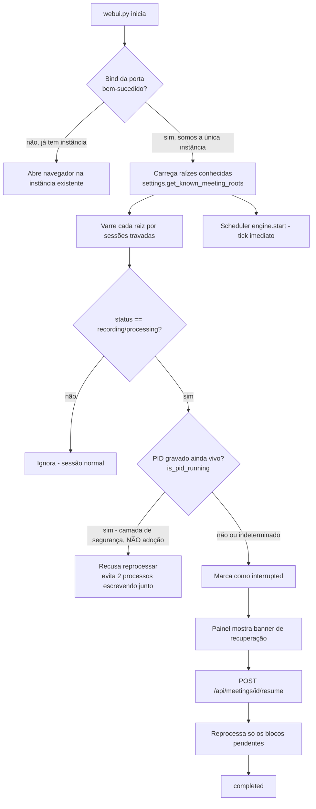
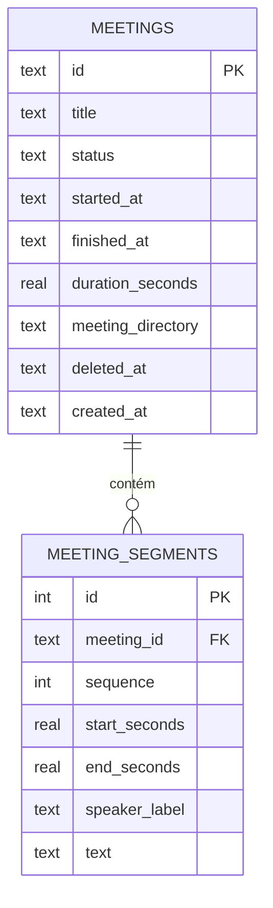
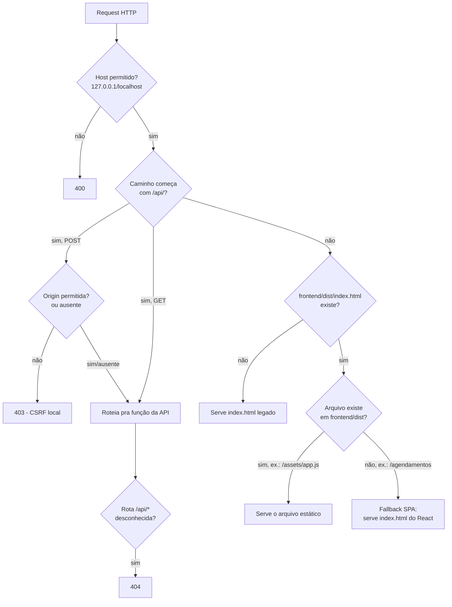
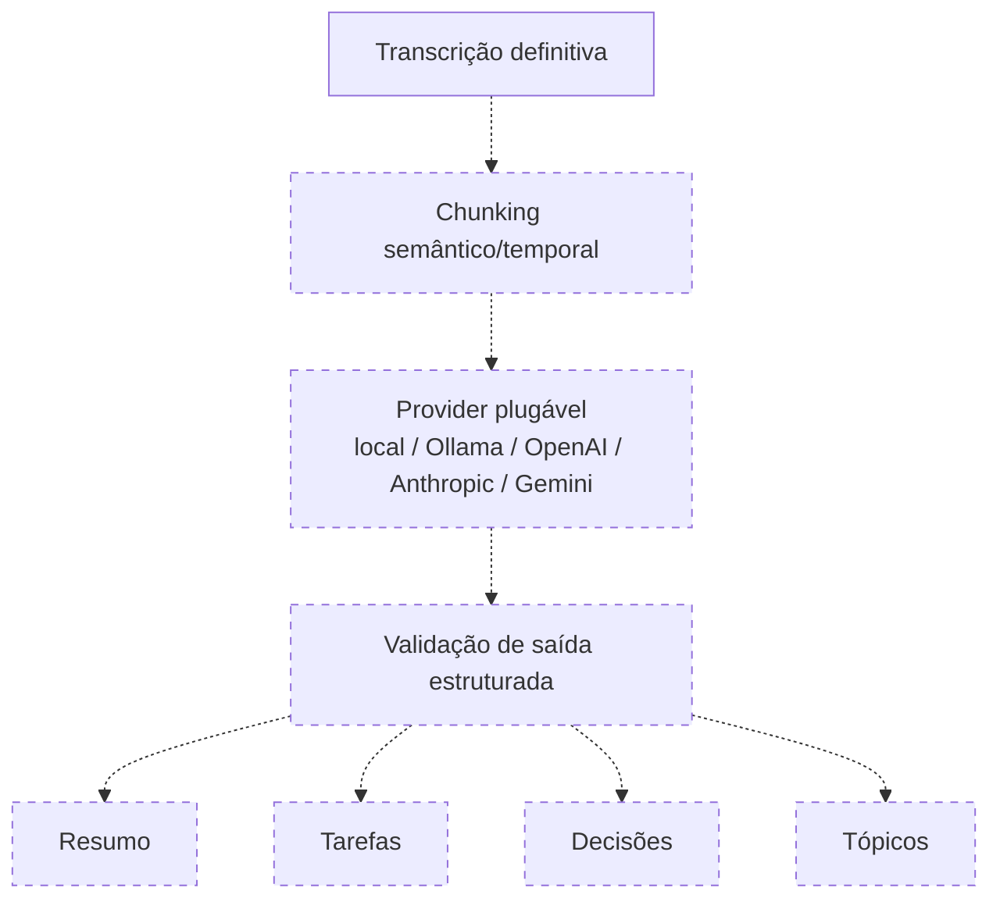

# Fluxogramas

Todos os diagramas abaixo refletem o **código real** implementado até a
missão de correção pós-auditoria (verificado por leitura direta de
`cli.py`/`webui.py`/`recorder.py`/`session.py`/`scheduling/engine.py`/
`live/pipeline.py`/`storage/`/`frontend/src/`, não uma intenção futura).
Onde uma etapa não existe ainda, ela é explicitamente marcada como
**Planejado**.

## 1 — Visão geral

`Meeting Intelligence` (resumo/tarefas/decisões, Fase G) está tracejado:
arquitetura planejada, sem implementação ainda. **Importante**: o Whisper
nunca escreve direto no SQLite — ele só escreve `transcript.md`/
`state.json` no filesystem; o SQLite é populado por uma importação que
roda **automaticamente** quando o processo de gravação termina
(`webui.py:_reader_thread`, correção pós-auditoria P1-2) ou manualmente
via `POST /api/meetings/import` (botão de sincronização, útil para
reimportar reuniões antigas ou recuperar de uma falha pontual de
indexação).

## 2 — Gravação

## 3 — Agendamento

## 4 — Encerramento gracioso

`terminate()`/`kill()` são o caminho de **exceção**, nunca o fluxo normal
— só acontecem se o processo não responder ao sinal gracioso dentro do
timeout (ver `webui.py:shutdown_sequence`). O estado `stopping` (correção
pós-auditoria P1-5) fica `true` do momento em que o pedido é aceito até o
processo realmente morrer — enquanto isso, um segundo `POST /api/stop` é
recusado (409) e o React mostra "Finalizando reunião..." em vez de
assumir que a gravação já parou.

## 5 — Recovery

## 6 — Dados (SQLite, Fase E)

Entrada no índice: **automática** ao final de toda gravação/reprocessamento
(`_reader_thread` chama `import_meeting` sozinho quando o processo
termina, sucesso ou não — correção pós-auditoria P1-2) ou manual via
`POST /api/meetings/import` (botão "Sincronizar histórico", útil pra
reimportar reuniões antigas do filesystem ou recuperar de uma falha
pontual de indexação, que nunca compromete os arquivos reais da reunião
— só fica registrada em log). `upsert_meeting`/`replace_segments` são
idempotentes: reimportar a mesma reunião nunca duplica.

`speaker_label` é preenchido na importação (Fase H leve): `"Você"`
(microfone), `"Áudio da reunião"` (sistema) ou `"Reunião"` (ambos) —
nunca um nome de pessoa. `search_index` (FTS5, quando disponível) não é
modelado aqui por ser uma tabela de apoio interna à busca, não uma
entidade de domínio.

Tabelas planejadas e **não implementadas**: `audio_chunks` e
`transcription_jobs` como entidades próprias (hoje cobertas por
`state.json` no filesystem), `SCHEDULE`/`SCHEDULE_RUN` em SQLite (hoje em
`schedules.json`, ver `docs/SCHEDULING.md`), `action_items`, `decisions`,
`topics`, `speakers`/`meeting_speakers` como tabelas de verdade (Fase G/H
completa).

## 8 — React servido pelo backend

`/api/*` nunca é interceptado pelo fallback de arquivo estático — uma
rota de API digitada errada continua 404, nunca vira a página do React
por engano. Guarda contra path traversal em `_serve_frontend_asset`
(resolve o caminho e confere que continua dentro de `frontend/dist`
antes de servir).

## 9 — Inteligência (Fase G — planejado, não implementado)

Todo este diagrama é planejado — nenhuma linha de código da Fase G existe
ainda. Mantido aqui só para mostrar onde ela se encaixaria na arquitetura
real já construída.
